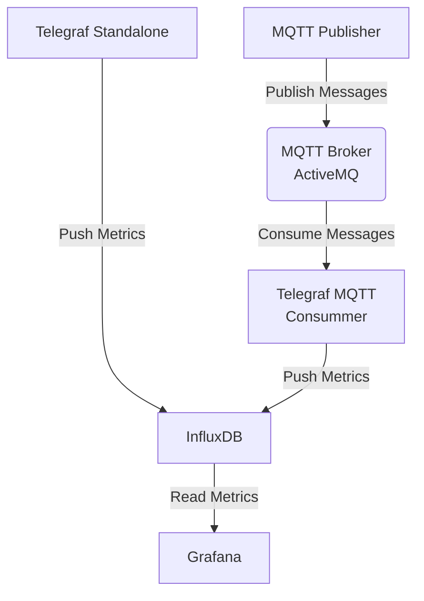

# Telegraf InfluxDB Grafana (TIG) Compose Stack

A bundle of configuration to run a TIG Compose stack. The stack is composed of the following elements :
- InfluxDB : to store metrics with TSDB storage and query/visualize metrics in dashboards
- Telegraf Standalone : a simple Telegraf instance that push server standard metrics (CPU, RAM, disk, network...)
- Grafana : to query/visualize metrics in dashboards
- ActiveMQ : to host MQTT messages queues
- MQTT Publisher : a custom image that push random metrics sensors (temperature, moisture, pressure, light)
- Telegraf MQTT Consummer : to consume MQTT messages emitted by MQTT Publisher

The following flow diagram shows the differents components :

